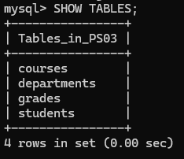
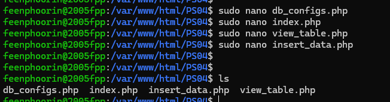
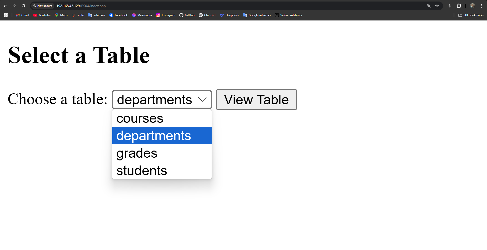
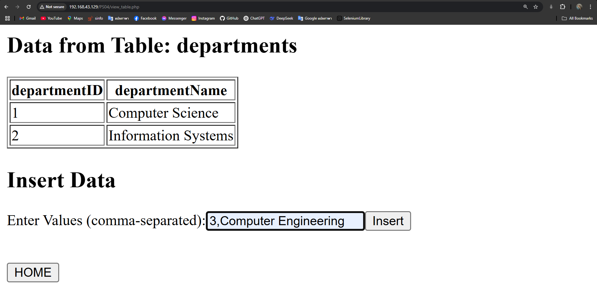
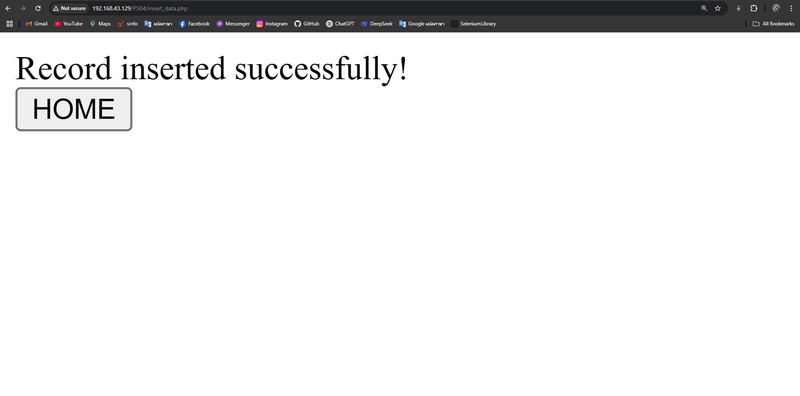
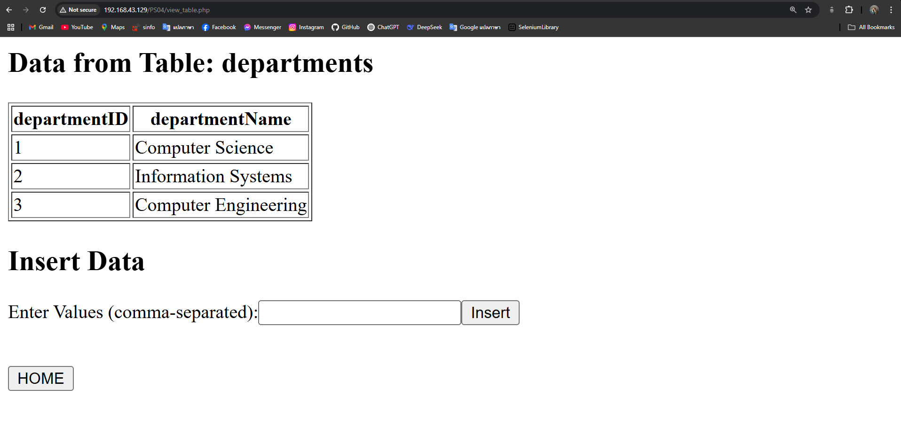

# Web Server to Query Database (LAMP Stack)

- Tech Stack : **LAMP** (Linux, Apache, MySQL, PHP) stack
- DATABASE : **PS03** ( database from problem session 3 )




## Project Setup

### Step 1: Navigate to the server's directory

```bash
cd /var/www/html
mkdir PS04
cd PS04
```

### Step 2: Create the database connection file

```bash
sudo nano db_configs.php
```

### Step 3: Create the homepage

```bash
sudo nano index.php
```

### Step 4: Create the view table file

```bash
sudo nano view_table.php
```

### Step 5: Create the data insertion file

```bash
sudo nano insert_data.php
```



---

## Demonstration Screenshots

### Step 1: Home Page

On the homepage, the user can select a table, such as the "departments" table, from the dropdown menu to view all the records.



### Step 2: Displaying Records And Inserting

After selecting a table, the records from the "departments" table will be shown on the web page. And to insert a new record, you can enter the values in a comma-separated format.



### Step 3: Successful Insertion

After successfully inserting the new record, a confirmation message will appear. You can click the "Home" button to return to the homepage.



### Step 4: Viewing the New Data

Once the record has been inserted, you can select the "departments" table again to view the newly inserted data.



---

## Conclusion

This project showcases the basic operations of viewing and inserting records into a MySQL database using PHP. With this simple LAMP stack application, you can query a database, insert new records, and see the results in a web interface.

---

### Additional Notes:
1. Make sure you have the LAMP stack set up and running for this project to work correctly.
2. Ensure your `db_configs.php` file contains the correct database connection settings.
